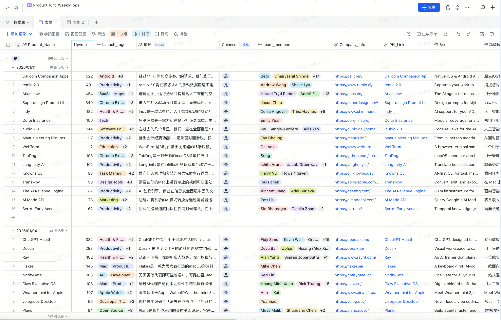
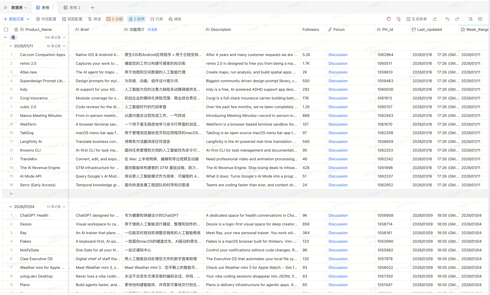

# ProductHunt Weekly Tops → Feishu Bitable Sync

[English](#english) | [中文](#中文)

---

<a name="english"></a>
# English

Automatically scrape the **ProductHunt weekly leaderboard** and sync it to a **Feishu (Lark) Bitable** table — with deduplication, team-member enrichment, and IM notifications.

## Preview

**View 1 — Core fields** (product name, upvotes, tags, Chinese description, team members, company info, PH link):



**View 2 — Extended fields** (brief, Chinese summary, full description, followers, forum link, PH ID, last updated, week range):



---

## Features

- **Auto-sync** — runs daily at 08:00 (Asia/Shanghai) via APScheduler; or run once on demand
- **Cloudflare bypass** — uses [DrissionPage](https://github.com/g1879/DrissionPage) (real Chromium) to handle JS challenges
- **Apollo SSR parsing** — extracts structured product data directly from ProductHunt's internal Apollo cache
- **Feishu Bitable integration** — creates new records or updates existing ones, deduplicated by `PH_Id`
- **Team member scraper** — enriches records with founder / team info by clicking through product pages
- **IM notification** — sends a Feishu chat message when each sync completes
- **Proxy support** — respects `http_proxy` / `https_proxy` / `all_proxy` env vars

---

## Architecture

```
ProductHunt weekly page
        │
        ▼ DrissionPage (Chromium, bypasses Cloudflare)
  Apollo SSR JSON
        │
        ▼ parse fields
  [name, tagline, votes, URL, makers, ...]
        │
        ├──▶ Feishu Bitable  (upsert by PH_Id)
        │
        └──▶ Feishu IM notification
             (sent after every sync)

(optional) scrape_team_drission.py
        │
        ▼ DrissionPage (click "Team" tab)
  team member names
        │
        └──▶ Feishu Bitable  (update team_members field)
```

---

## Prerequisites

| Requirement | Version |
|---|---|
| Python | 3.9+ |
| Chrome / Chromium | installed locally |
| Feishu (Lark) developer app | with Bitable & IM permissions |
| ProductHunt account | optional (cookies help bypass 403) |

---

## Setup

### 1. Clone & install

```bash
git clone https://github.com/chattingclaire/ProductHunt_WeeklyTops.git
cd ProductHunt_WeeklyTops

python -m venv .venv
source .venv/bin/activate   # Windows: .venv\Scripts\activate

pip install -r requirements.txt
```

### 2. Configure environment variables

```bash
cp .env.example .env
# then edit .env with your credentials
```

| Variable | Required | Description |
|---|---|---|
| `FEISHU_APP_ID` | Yes | Feishu / Lark app ID |
| `FEISHU_APP_SECRET` | Yes | Feishu / Lark app secret |
| `FEISHU_TABLE_APP_ID` | Yes | Bitable app token (starts with `BAS...`) |
| `FEISHU_TABLE_ID` | Yes | Table ID inside the Bitable |
| `FEISHU_RECEIVER_OPEN_ID` | Yes | Open ID of the IM notification recipient |
| `PH_WEEKLY_URL` | No | Override the weekly URL; omit to auto-compute |
| `PH_WEEK_OFFSET` | No | Integer offset from current week (`-1` = last week) |
| `PH_BEARER_TOKEN` | No | ProductHunt Bearer token (legacy fallback, not needed) |
| `PH_COOKIES` | No | Cookie string — strongly recommended to avoid 403 |
| `TIMEZONE` | No | Default `Asia/Shanghai` |
| `ENABLE_TEAM_SCRAPER` | No | Set `true` to run team scraper after main sync |
| `http_proxy` | No | HTTP proxy (e.g. `http://127.0.0.1:7890`) |
| `https_proxy` | No | HTTPS proxy |

### 3. Get ProductHunt cookies (recommended)

Cookies let DrissionPage bypass Cloudflare rate limits:

1. Open [producthunt.com](https://www.producthunt.com) in Chrome and log in
2. Press `F12` → **Application** tab → **Cookies** → `https://www.producthunt.com`
3. Copy all cookies in the format `key1=value1; key2=value2`
4. Paste as `PH_COOKIES=...` in your `.env`

Key cookies to look for: `_producthunt_session`, `cf_clearance`, `__cf_bm`

### 4. Set up Feishu Bitable

Your Bitable table should have (at minimum) these fields:

| Field name | Type | Notes |
|---|---|---|
| `PH_Id` | Text | Unique product ID — used for deduplication |
| `Product_Name` | Text | Product name |
| `Brief` | Text | One-line tagline |
| `Upvote` | Number | Upvote count |
| `PH_Link` | URL | Product Hunt link |
| `Week_Range` | Text | ISO week string, e.g. `2025-W44` |
| `team_members` | Text | Populated by team scraper (optional) |

---

## Usage

### Run once immediately

```bash
python wokflow.py --once
```

### Start the daily scheduler (08:00 Asia/Shanghai)

```bash
python wokflow.py
```

### Scrape team members for existing records

```bash
# Dry run — print results without writing to Feishu
python scrape_team_drission.py --dry-run

# Process up to 20 records with empty team_members
python scrape_team_drission.py --limit 20

# Process all
python scrape_team_drission.py
```

### Fetch a specific week

```bash
PH_WEEK_OFFSET=-1 python wokflow.py --once   # last week
PH_WEEKLY_URL=https://www.producthunt.com/leaderboard/weekly/2025/10 python wokflow.py --once
```

---

## Project Structure

```
.
├── wokflow.py                # Main workflow: fetch PH → sync Feishu
├── scrape_team_drission.py   # Team member enrichment via DrissionPage
├── scrape_empty_records.py   # Re-process records missing data
├── update_from_weekly.py     # Utility to back-fill weekly data
├── import_team_members.py    # Import team data from local JSON
├── requirements.txt          # Python dependencies
├── .env.example              # Environment variable template
└── assets/                   # README screenshots
```

---

## Dependencies

```
requests
APScheduler
python-dotenv
pytz
DrissionPage>=4.0.0
```

---

## Troubleshooting

**Cloudflare 403 / challenge loop**
→ Add `PH_COOKIES` to `.env`. Make sure `cf_clearance` is included and fresh.

**DrissionPage can't find Chrome**
→ Install Chrome, or set `CHROMIUM_PATH` to your browser binary.

**Feishu token error**
→ Verify `FEISHU_APP_ID` / `FEISHU_APP_SECRET` and that the app has *Bitable* and *Message* permissions.

**Records not deduplicating**
→ Check that `PH_Id` field exists in your table and contains the correct product IDs.

---

## License

MIT — see [LICENSE](LICENSE).

---

## Contributing

PRs and issues welcome! If ProductHunt changes its page structure and parsing breaks, please open an issue with the new HTML snippet.

---

<a name="中文"></a>
# 中文

自动抓取 **ProductHunt 每周榜单**，同步到**飞书多维表格**，支持去重、团队成员补充爬取和 IM 消息通知。

## 效果预览

**视图一 — 核心字段**（产品名、票数、标签、中文描述、团队成员、公司信息、PH 链接）：


**视图二 — 扩展字段**（Brief、功能简介、完整描述、Followers、论坛链接、PH ID、更新时间、周次）：


---

## 功能特点

- **定时自动同步** — 每天 08:00（Asia/Shanghai）自动运行，也支持手动触发
- **绕过 Cloudflare** — 使用 [DrissionPage](https://github.com/g1879/DrissionPage)（真实 Chromium 内核）处理 JS 挑战
- **Apollo SSR 解析** — 直接从 ProductHunt 内置 Apollo 缓存中提取结构化数据
- **飞书多维表格集成** — 按 `PH_Id` 去重，自动新增或更新记录
- **团队成员爬取** — 独立脚本，点击产品页面的 Team 标签抓取创始人 / 团队信息
- **IM 消息通知** — 每次同步完成后发送飞书消息提醒
- **代理支持** — 读取 `http_proxy` / `https_proxy` / `all_proxy` 环境变量

---

## 系统要求

| 依赖 | 版本要求 |
|---|---|
| Python | 3.9+ |
| Chrome / Chromium | 本地已安装 |
| 飞书开发者应用 | 需开通多维表格 & 消息权限 |
| ProductHunt 账号 | 可选（有 cookies 更稳定） |

---

## 安装配置

### 1. 克隆并安装依赖

```bash
git clone https://github.com/chattingclaire/ProductHunt_WeeklyTops.git
cd ProductHunt_WeeklyTops

python -m venv .venv
source .venv/bin/activate   # Windows: .venv\Scripts\activate

pip install -r requirements.txt
```

### 2. 配置环境变量

```bash
cp .env.example .env
# 编辑 .env，填入你的密钥
```

| 变量名 | 是否必填 | 说明 |
|---|---|---|
| `FEISHU_APP_ID` | 是 | 飞书应用 App ID |
| `FEISHU_APP_SECRET` | 是 | 飞书应用 App Secret |
| `FEISHU_TABLE_APP_ID` | 是 | 多维表格 App Token（以 `BAS...` 开头） |
| `FEISHU_TABLE_ID` | 是 | 数据表 ID |
| `FEISHU_RECEIVER_OPEN_ID` | 是 | IM 通知接收人的 Open ID |
| `PH_WEEKLY_URL` | 否 | 手动指定周榜 URL，不填则自动计算 |
| `PH_WEEK_OFFSET` | 否 | 周偏移量，`-1` 表示上一周 |
| `PH_BEARER_TOKEN` | 否 | PH Bearer Token（旧版备用，一般不需要） |
| `PH_COOKIES` | 否 | Cookie 字符串，强烈推荐填写以避免 403 |
| `TIMEZONE` | 否 | 默认 `Asia/Shanghai` |
| `ENABLE_TEAM_SCRAPER` | 否 | 设为 `true` 则主同步后自动运行团队爬取 |
| `http_proxy` | 否 | HTTP 代理，如 `http://127.0.0.1:7890` |
| `https_proxy` | 否 | HTTPS 代理 |

### 3. 获取 ProductHunt Cookies（推荐）

Cookies 可让 DrissionPage 绕过 Cloudflare 频率限制：

1. 用 Chrome 打开 [producthunt.com](https://www.producthunt.com) 并登录
2. 按 `F12` → **Application** 标签 → **Cookies** → `https://www.producthunt.com`
3. 复制所有 cookies，格式为 `key1=value1; key2=value2`
4. 粘贴到 `.env` 的 `PH_COOKIES=...`

重点关注：`_producthunt_session`、`cf_clearance`、`__cf_bm`

### 4. 配置飞书多维表格字段

数据表至少需要以下字段：

| 字段名 | 类型 | 说明 |
|---|---|---|
| `PH_Id` | 文本 | 产品唯一 ID，用于去重 |
| `Product_Name` | 文本 | 产品名称 |
| `Brief` | 文本 | 一句话描述 |
| `Upvote` | 数字 | 票数 |
| `PH_Link` | 链接 | ProductHunt 链接 |
| `Week_Range` | 文本 | 周次，如 `2025-W44` |
| `team_members` | 文本 | 由团队爬取脚本填充（可选） |

---

## 使用方法

### 立即执行一次

```bash
python wokflow.py --once
```

### 启动定时任务（每天 08:00）

```bash
python wokflow.py
```

### 爬取团队成员信息

```bash
# 试运行，只打印结果不写入飞书
python scrape_team_drission.py --dry-run

# 处理最多 20 条 team_members 为空的记录
python scrape_team_drission.py --limit 20

# 处理全部
python scrape_team_drission.py
```

### 抓取指定周次

```bash
PH_WEEK_OFFSET=-1 python wokflow.py --once   # 上一周
PH_WEEKLY_URL=https://www.producthunt.com/leaderboard/weekly/2025/10 python wokflow.py --once
```

---

## 项目结构

```
.
├── wokflow.py                # 主流程：抓取 PH → 同步飞书
├── scrape_team_drission.py   # 团队成员爬取（DrissionPage）
├── scrape_empty_records.py   # 补充缺失数据的工具脚本
├── update_from_weekly.py     # 回填历史周数据
├── import_team_members.py    # 从本地 JSON 导入团队数据
├── requirements.txt          # Python 依赖
├── .env.example              # 环境变量模板
└── assets/                   # README 截图
```

---

## 常见问题

**Cloudflare 403 / 反复出现挑战页面**
→ 在 `.env` 中添加 `PH_COOKIES`，确保包含 `cf_clearance` 且未过期。

**DrissionPage 找不到 Chrome**
→ 确认本地已安装 Chrome，或设置 `CHROMIUM_PATH` 指向浏览器可执行文件。

**飞书 Token 报错**
→ 检查 `FEISHU_APP_ID` / `FEISHU_APP_SECRET` 是否正确，并确认应用已开通多维表格和消息权限。

**记录没有去重**
→ 确认多维表格中存在 `PH_Id` 字段，且内容与脚本写入的格式一致。

---

## License

MIT — 详见 [LICENSE](LICENSE)。

---

## 贡献

欢迎提 PR 和 Issue！如果 ProductHunt 更新了页面结构导致解析失败，请附上新的 HTML 片段开 Issue。
