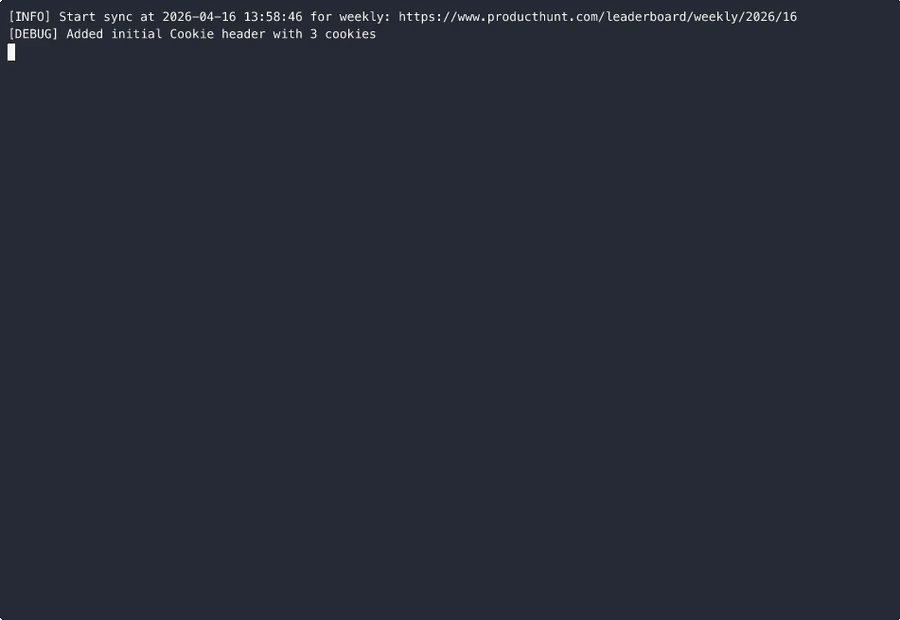

# ProductHunt Leaderboard → Feishu Bitable

[English](#english) | [中文](#中文)

---

<a name="english"></a>
# English

Scrape any **ProductHunt leaderboard** (weekly by default) and sync every product into a **Feishu (Lark) Bitable** table — auto-dedup, team enrichment, and IM notifications.



## Quick Start

**1. Install the Claude Code skill**

```bash
claude skill install producthunt-feishu-sync.skill
```

**2. Copy and fill in credentials**

```bash
cp .env.example .env
```

Open `.env` and fill in:

```
FEISHU_APP_ID=...          # Feishu developer console → your app → Credentials
FEISHU_APP_SECRET=...
FEISHU_TABLE_APP_ID=...    # BASxxx… from your Bitable URL
FEISHU_TABLE_ID=...        # tblXXX from your Bitable URL
FEISHU_RECEIVER_OPEN_ID=...
PH_COOKIES=...             # Chrome → F12 → Application → Cookies → copy all
```

**3. Create Feishu Bitable fields**

Download [`assets/feishu_bitable_template.xlsx`](assets/feishu_bitable_template.xlsx) and import it into your Bitable — all 13 fields are pre-defined with correct names. After importing, manually adjust these field types:

| Field | Type |
|---|---|
| `Upvote` | Number |
| `Launch_tags` | Multi-select |
| `PH_Link` | URL |
| `Forum` | URL |
| `Company_Info` | URL |

All other fields can stay as Text.

**4. Ask your agent**

```
"Run the ProductHunt weekly sync"
"Sync last week's PH leaderboard to Feishu"
"team members are empty, fix it"
```

---

## Which Leaderboard to Scrape

By default the script targets the **current ISO week** leaderboard automatically.
You can point it at any leaderboard by setting `PH_WEEKLY_URL` in `.env`:

| Leaderboard | URL format | Example |
|---|---|---|
| Weekly (default) | `/leaderboard/weekly/YYYY/WW` | `…/weekly/2025/44` |
| Specific week | `/leaderboard/weekly/YYYY/WW` | `…/weekly/2025/10` |
| Daily | `/leaderboard/daily/YYYY/MM/DD` | `…/daily/2025/11/25` |
| Monthly | `/leaderboard/monthly/YYYY/MM` | `…/monthly/2025/11` |

```bash
# Last week
PH_WEEK_OFFSET=-1 python wokflow.py --once

# Specific week
PH_WEEKLY_URL=https://www.producthunt.com/leaderboard/weekly/2025/10 python wokflow.py --once

# Daily leaderboard
PH_WEEKLY_URL=https://www.producthunt.com/leaderboard/daily/2025/11/25 python wokflow.py --once
```

> **Note:** The script is optimized for weekly leaderboards. Daily and monthly URLs should work since PH uses the same page structure, but `Week_Range` and related fields will reflect the weekly ISO calculation regardless of the URL you use.

---

## Preview

**Core fields** — product name, upvotes, tags, Chinese description, team members, company info, PH link:


**Extended fields** — brief, full description, followers, forum link, PH ID, last updated, week range:


---

## How It Works

**Stage 1 — Leaderboard page (Apollo SSR JSON)**
PH leaderboard pages embed a full data snapshot. The script reads it directly — no API key needed.
→ `Product_Name` · `Brief` · `Description` · `Upvote` · `Launch_tags` · `team_members` · `PH_Link` · `Forum` · `PH_Id` · `Week_Range`

**Stage 2 — Per-product pages (DrissionPage / real Chromium)**
Three fields aren't in the leaderboard data, so the script opens each product page in a real browser.
→ `Followers` · `Company_Info` · `team_members` (enriched from `/makers` sub-page)

---

## Manual Usage

```bash
pip install -r requirements.txt
python wokflow.py --once              # run immediately
python wokflow.py                     # daily scheduler (08:00 Asia/Shanghai)
python scrape_team_drission.py --limit 20   # enrich team members only
```

---

## Troubleshooting

| Problem | Fix |
|---|---|
| Cloudflare 403 | Refresh `PH_COOKIES` in `.env` (include `cf_clearance`) |
| Field missing in Feishu | Create the field — names are case-sensitive |
| Feishu auth error | Check app ID/secret; enable Bitable + Message permissions |
| `team_members` empty | PH may have updated its page structure — ask your agent to check |

---

## License

MIT

---

<a name="中文"></a>
# 中文

抓取 **ProductHunt 任意榜单**（默认周榜），将每个产品同步到**飞书多维表格**，支持去重、团队成员补充爬取和 IM 消息通知。

## 快速开始

**1. 安装 Claude Code Skill**

```bash
claude skill install producthunt-feishu-sync.skill
```

**2. 填写密钥**

```bash
cp .env.example .env
```

打开 `.env` 填入：

```
FEISHU_APP_ID=...          # 飞书开发者后台 → 你的应用 → 凭证与基础信息
FEISHU_APP_SECRET=...
FEISHU_TABLE_APP_ID=...    # 多维表格 URL 里的 BASxxx…
FEISHU_TABLE_ID=...        # 多维表格 URL 里的 tblXXX
FEISHU_RECEIVER_OPEN_ID=...
PH_COOKIES=...             # Chrome → F12 → Application → Cookies → 全部复制
```

**3. 建飞书多维表格字段**

下载 [`assets/feishu_bitable_template.xlsx`](assets/feishu_bitable_template.xlsx) 导入飞书多维表格，13 个字段名称自动创建好。导入后手动调整以下字段类型：

| 字段 | 类型 |
|---|---|
| `Upvote` | 数字 |
| `Launch_tags` | 多选 |
| `PH_Link` | 超链接 |
| `Forum` | 超链接 |
| `Company_Info` | 超链接 |

其余字段保持文本类型即可。

**4. 告诉你的 agent**

```
"帮我跑一下 PH 周榜同步"
"同步上周的 ProductHunt 榜单到飞书"
"team members 都是空的，帮我修一下"
```

---

## 抓哪个榜单

默认自动抓**当前 ISO 周的周榜**。在 `.env` 里设置 `PH_WEEKLY_URL` 可以切换任意榜单：

| 榜单类型 | URL 格式 | 示例 |
|---|---|---|
| 周榜（默认） | `/leaderboard/weekly/YYYY/WW` | `…/weekly/2025/44` |
| 指定某周 | `/leaderboard/weekly/YYYY/WW` | `…/weekly/2025/10` |
| 日榜 | `/leaderboard/daily/YYYY/MM/DD` | `…/daily/2025/11/25` |
| 月榜 | `/leaderboard/monthly/YYYY/MM` | `…/monthly/2025/11` |

```bash
# 上周
PH_WEEK_OFFSET=-1 python wokflow.py --once

# 指定某周
PH_WEEKLY_URL=https://www.producthunt.com/leaderboard/weekly/2025/10 python wokflow.py --once

# 日榜
PH_WEEKLY_URL=https://www.producthunt.com/leaderboard/daily/2025/11/25 python wokflow.py --once
```

> **说明：** 脚本针对周榜优化，日榜和月榜因为 PH 页面结构相同应该也可以用，但 `Week_Range` 等字段仍按 ISO 周计算。

---

## 效果预览

**核心字段** — 产品名、票数、标签、中文描述、团队成员、公司信息、PH 链接：


**扩展字段** — Brief、完整描述、Followers、论坛链接、PH ID、更新时间、周次：


---

## 工作原理

**阶段一 — 榜单页面 Apollo SSR JSON**
PH 榜单页面内嵌完整数据快照，脚本直接读取，无需 API Key。
→ `Product_Name` · `Brief` · `Description` · `Upvote` · `Launch_tags` · `team_members` · `PH_Link` · `Forum` · `PH_Id` · `Week_Range`

**阶段二 — 产品独立页面（DrissionPage 真实 Chromium）**
三个字段不在榜单数据中，脚本用真实浏览器逐页抓取。
→ `Followers` · `Company_Info` · `team_members`（来自 `/makers` 子页面的完整版）

---

## 手动运行

```bash
pip install -r requirements.txt
python wokflow.py --once               # 立即执行一次
python wokflow.py                      # 每天 08:00 定时任务
python scrape_team_drission.py --limit 20    # 只补爬团队成员
```

---

## 常见问题

| 问题 | 解决方法 |
|---|---|
| Cloudflare 403 | 刷新 `.env` 里的 `PH_COOKIES`（包含 `cf_clearance`） |
| 飞书字段找不到 | 建立缺失字段，注意大小写 |
| 飞书 Token 报错 | 检查 App ID/Secret，开通多维表格 + 消息权限 |
| `team_members` 为空 | PH 可能改版，让 agent 帮你检查选择器 |

---

## License

MIT
